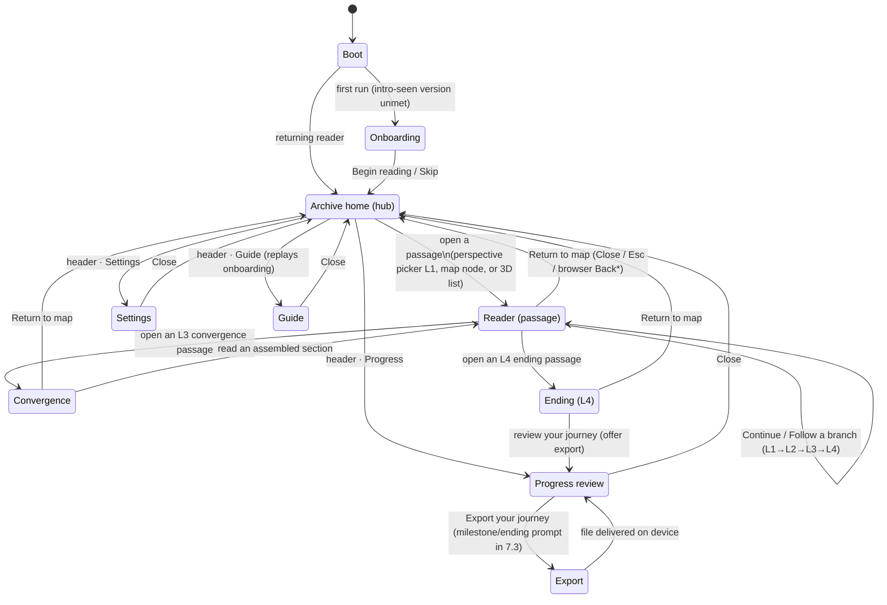

# Phase 7.1 — Canonical reader journey (design proposal)

This document is the **proposed** authoritative reader journey for Narramorph, produced before any 7.1 code per the Phase 4/5/6 "propose the design first for a product/architecture fork" workflow. It contains the four things the roadmap and the batch charter ask for up front:

1. the **canonical first-run state map** — every reader state from page load to export, each with one primary action and a predictable back/close;
2. the **label-consistency inventory** across the 2D map, 3D view, progress, and reader, with a proposed single lexicon;
3. the **progress model** restructured to the four axes the roadmap names; and
4. the **moderated first-time-usability script** — the 7.1 acceptance gate.

It also **surfaces the 7.2 reader-architecture fork** (modal vs. route-addressable) with a recommendation, because 7.1's "one shared reader" decision and 7.2's architecture decision are coupled.

Nothing here changes runtime code. All findings are cited to real files at branch base `145b79b`. The moderated session and the label walk-through are owner/tester-run; **no usability or screen-reader results are fabricated**.

> **Copy discipline (ADR 0002).** Everything proposed here is **interface chrome** (labels, headings, hints, a11y strings) — never authored runtime prose. Any chrome string that would quote canon needs M-R care; none of the proposed strings do. The perspective labels ("The Archaeologist" …) already ship and reuse N's own identifiers.

---

## 1. Canonical reader-journey state map

### 1.1 The states

The product is a **single page** (`App → Layout → Home`) with a persistent **archive home** (header + opening picker + story map + footer) as the hub, and a set of **overlays** (reader, progress, settings, guide, convergence) that open over it. The story is chosen once from `?story=` (default `eternal-return`). There is **no router today** (see §6).

`*` browser **Back** closing the reader is a **proposed** behavior that depends on the 7.2 reader-architecture decision (§6). Today Back does not close the reader.

### 1.2 One primary action + predictable back/close per state

| State | Component(s) | **One primary action** | Back / close (predictable) | Notes / proposed change |
| --- | --- | --- | --- | --- |
| **Boot** | `Home` init | — (auto-advances) | — | Loads story + progress; shows a status region while lazy chunks load. |
| **Onboarding** (first run) | `Onboarding/IntroDialog` | **Begin reading** | **Skip** / Esc → Archive home; focus restored | Already accessible (focus trap/restore, reduced-motion). Keep. |
| **Archive home (hub)** | `OpeningExperience` + `NodeMap`/`NarromorphCanvas` + `AppHeader`/`AppFooter` | **Open a passage** (choose a perspective / a map node) | n/a (this is the hub) | The persistent picker should **recede after the reader has begun** so the map is the primary surface on return (see §5). |
| **Reader (passage)** | `StoryView` (2D) / `ContentPanel3D` (3D) | **Continue** (single onward) **or Follow** (a branch) | **Return to map** (text) + **Close** (icon) + Esc; focus restored to the origin node | 3D reader must reach **parity** — it lacks the branch footer and bridge today (§5). |
| **Convergence (L3)** | `UI/L3AssemblyView` | **Read the assembled convergence** | **Return to map**; focus restored | Should share the reader's close/return semantics and labels. |
| **Ending (L4)** | reader (`layer === 4`) | **Review your journey** (offer export) | **Return to map** | The ending is the natural, non-nagging place to offer export (7.3). |
| **Progress review** | `Layout/ProgressDialog` | **Export your journey** (when a journey exists) | **Close** / Esc; focus restored | Restructure metrics to the four axes (§4). |
| **Export** | `Layout/JourneyExportActions` | **Export journey** (Markdown) | returns to Progress | Keep on-device; 7.3 adds the milestone/ending entry point + notes toggle; 7.4 adds the machine-readable save export/import. |
| **Settings** | `Layout/SettingsDialog` | (adjust preference) | **Close** / Esc; focus restored | 7.2 adds line-height alongside text-size + theme. |
| **Guide** | `Onboarding/IntroDialog` (`origin='help'`) | **Close guide** | **Back to the archive** / Esc | Replays onboarding on demand. Keep. |

Every overlay already routes through `useDialogFocus` (containment + restoration + Escape + background inerting). The canonical rule for 7.1: **every overlay has exactly one primary action, an always-present Close, and Escape; focus always restores to the control that opened it.**

---

## 2. Label-consistency inventory (2D / 3D / progress / reader)

The same concept is currently named several ways across surfaces — the exact problem 7.1 targets ("conflicting terminology, and controls that exist only because of implementation history"). Below is the current state (cited), then the **proposed single lexicon**.

### 2.1 Current terms in use (by concept)

| Concept | Terms found today | Where (file) |
| --- | --- | --- |
| The content unit | **fragment** / **passage** / **node** | "fragments" — `AppFooter`, `AppHeader` aria, `NodeMapHud` visual, `SceneNodeList`, `ProgressDialog` ("Fragments encountered"). "passage" — `NodeMap` region "Archive passage map", node aria + `aria-roledescription="passage"`, `NodeMapHud` sr-only "archive passages opened", `StoryHeader` "Recovered passage", `Home` loading states, `ContentPanel3D` region "Story passage". "node" — `SceneNodeList` "Node index"/nav "Story nodes", 3D app aria "Three-dimensional story node map". |
| Opening/reading it | **visited** / **opened** / **encountered** / **read** / **traced** | "visited" — `AppFooter`/node aria/`StoryHeader` "Visit #"/`SceneNodeList` "Visited". "opened" — `NodeMapHud` "passages opened"/progressbar/"Open". "encountered" — `ProgressDialog` "Fragments encountered" + "encounter N". "read" — `JourneyExportActions`. "traced" — `AppFooter` "% traced". |
| Progress percentage | **% traced** / **Archive charted** / **World explored** | Footer `progressPercent` "% traced"; `ProgressDialog` "Archive charted" (same value) **and** "World explored" (`stats.percentageExplored`, a _different_ value) — two metrics, three labels. |
| Unavailable | **veiled** / **locked** | "veiled" — `NodeMapHud`. "locked"/"Locked" — node aria, `SceneNodeList`. |
| Available | **illuminated** / **available** | "illuminated fragment" — `NodeMapHud`; "available" — node aria, `SceneNodeList`. |
| Close the reader | **Close story view** / **Return to map** / **Close content panel** | `StoryHeader` X = "Close story view"; `StoryFooter` button = "Return to map"; `ContentPanel3D` X = "Close content panel" (+ sr "return to the spatial map"). |
| The map surface | **Archive passage map** / **Archive map** / **Three-dimensional story node map** / **Story nodes** / **Node index** | 2D `NodeMap` region + `NodeMapHud`; 3D `NarromorphCanvas` app + `SceneNodeList`. |
| Perspective | **perspective** / **voice** / **witness** | `OpeningExperience` ("Choose a perspective", "Choose a voice", "Three witnesses survived"). |
| Perspective names | **The Archaeologist / The Algorithm / The Last Human / The Convergence** vs **Archaeologist / Algorithm / Human** | `getCharacterLabel`, `OpeningExperience`, `SceneNodeList` use the full "The …" set; `ProgressDialog` "By perspective" drops "The" and uses "**Human**" for the Last Human. |
| Reader state chip | **First Visit / Returning / Meta-Aware** | `getStateLabel`. Consistent — keep. |

### 2.2 Proposed canonical lexicon (owner decision #1)

One word per concept, chosen for reader clarity and accessibility. **Recommended defaults** (the owner may override any row — the "fragment vs passage" choice in particular is a brand call):

| Concept | **Proposed canonical term** | Rationale |
| --- | --- | --- |
| Content unit | **passage** | Literary and already the reader-facing word ("Recovered passage"). Avoids colliding with the **canonical in-fiction object "Fragment 2749-A"** — using "fragment" for the UI unit overloads a canon noun. (If the owner prefers "fragment" as the evocative brand term, we standardize on that everywhere instead.) |
| The act of opening | **open** (a passage) / **read** (once its text is shown) | Matches the roadmap's progress axis "passages **opened**". Retire "encountered", "traced", "charted" as reader-facing verbs. |
| Return to it | **revisit** | Single verb for the return mechanic; pairs with the "Returning" state chip. |
| Unavailable | **locked** | Plain and accessible; "veiled" is atmospheric but opaque to AT. Keep "veiled" only as decorative flavor if paired with the plain status. |
| Available | **available** (status) / "open this passage" (action) | Retire "illuminated" as the _status_ word (keep as visual style only). |
| Close the reader | Icon button **"Close"**; text button **"Return to map"** — identical in 2D and 3D | One pair of labels for both readers; today there are three. |
| Map surface | **Story map** (2D) and **Story map (3D view)**; the 3D companion is the **"Passage list"** | Collapses "node map"/"passage map"/"node index"/"story nodes" to one family. |
| Perspective | **perspective** (retire "voice"/"witness" as synonyms in chrome) | Onboarding may still use "witness" as narrative flavor once, but chrome labels say "perspective". |
| Perspective names | **The Archaeologist / The Algorithm / The Last Human / The Convergence** everywhere | Fix `ProgressDialog` "By perspective" to the full set ("The Last Human", not "Human"). |

**Progress percentage:** show exactly **one** headline percentage (passages opened ÷ total) and label it identically in the footer and the progress dialog. If the secondary `percentageExplored` metric stays, it gets a clearly distinct name and definition (§4), not a near-synonym.

---

## 3. Duplicate entry points & history-only controls to remove or reconcile

| Item | Finding | Proposed disposition |
| --- | --- | --- |
| Perspective picker vs. map nodes | `OpeningExperience` (curated L1 entry) and the map both open passages via the **same interaction adapter** — not a true duplicate, but two always-on surfaces competing for the first screen. | **Keep both, but make them complementary:** the picker is "start here" (L1 only) and **recedes/collapses after the reader has begun**, giving the map primacy on return. |
| 2D reader vs. 3D reader divergence | `StoryView` (2D) has bridge prose (`StoryBridge`), a branch/continuation footer, a state chip, and a "Recovered passage" eyebrow. `ContentPanel3D` (3D) has **none of those**, plus a live "Time spent" timer and different error copy the 2D reader lacks. Different close labels. | **Reconcile to one reader experience** regardless of view: same continuation footer, same bridge, same close/return labels. Cleanest via a **shared reader body** (couples to the §6 decision). The 3D live timer is an implementation-history artifact — remove or move behind Settings for both. |
| Reading-time source | 2D uses `formatEstimatedReadingTime(content)`; 3D uses `metadata.estimatedReadTime`. | Use **one** source so the estimate matches across views. |
| Two progress percentages | `progressPercent` ("% traced" / "Archive charted") and `stats.percentageExplored` ("World explored") sit side by side with near-synonym labels. | Collapse to the four-axis model (§4); one headline percentage. |
| 3D mode toggle label | `Home` toggle reads "Experimental 3D" / "Return to 2D archive"; the map is elsewhere called the "story map". | Align to the lexicon: "Experimental 3D view" / "Return to 2D map". |

---

## 4. Progress model — the four roadmap axes (owner decision #2)

The roadmap requires the progress model to **distinguish passages opened / paths explored / endings reached / adaptations discovered**. Today's dialog shows "Fragments encountered", "Archive charted %", "Essential thread", "World explored %" plus a narrative path and the adaptation ledger — overlapping and missing two of the four axes. Proposed four tiles, each backed by data that already exists in `UserProgress`:

| Axis | Definition | Source (already in state) |
| --- | --- | --- |
| **Passages opened** | distinct passages read ÷ total | `visitedNodes` / `nodes.size` |
| **Paths explored** | distinct onward branches taken (or perspectives entered) | `readingPath` transitions / `unlockedL2Characters` |
| **Endings reached** | 0–3 of the L4 endings | count of visited `layer === 4` nodes |
| **Adaptations discovered** | distinct adaptive selections the reader has seen | `selectionRecords` length (drives the ledger) |

"Essential thread" (`criticalPathNodesVisited`) and any secondary exploration percentage become optional detail below the four headline tiles, not competing headline metrics. This makes the gate's requirement mechanically testable (four named counters) and removes the near-synonym percentages.

---

## 5. Revisitation discovery (owner decision #3)

The mechanic — reopening a passage can change its prose — must be **discoverable without being forced** (charter principle 2: literature first). Options, least → most prominent:

- **A. Onboarding + state only (lowest touch).** The intro already names revisiting; the map node aria already says "the passage changed on return". Add a quiet visual **revisit marker** on already-opened passages (a dot/ring, with a text alternative), and nothing else.
- **B. A (marker) + one contextual, dismissible hint (recommended).** The first time a _changed_ revisit becomes available, show a single non-blocking line near the map ("The archive remembers — a passage you've opened has changed. Reopen it when you like.") that never repeats once dismissed.
- **C. B + a "Revisit" affordance in the reader footer** inviting the reader back to a changed passage. Most discoverable, closest to nudging.

**Recommendation: B** — discoverable, one-time, dismissible, never blocks reading, works with keyboard and AT, and honors reduced-motion (static marker). The owner sets the intrusiveness.

---

## 6. Surfaced for 7.2 — reader architecture fork (modal vs. route-addressable)

The batch charter flags this as the key architecture fork. Recording it here because 7.1's "one shared reader" reconciliation (§3) and 7.2's long-passage work both depend on it. **Today:** the reader is a modal dialog (`StoryView` 2D + `ContentPanel3D` 3D) built on `useDialogFocus`; there is **no router**; the app is one page and the story id comes from `?story=` read once. The roadmap's concern: "avoid modal traps that make a long reading session feel disconnected from browser navigation; consider route-addressable passage views **while preserving focus behavior**."

| Option | What changes | Pros | Cons / risk |
| --- | --- | --- | --- |
| **1. Keep the modal, harden it** | Add landmarks, scroll restoration, text/line-height prefs, unified continuation footer inside the existing modal. | Lowest risk; no new dependency; `useDialogFocus` containment already proven. | Browser **Back** still doesn't close the reader; passages aren't URL-addressable/bookmarkable — the exact "modal trap" the roadmap warns about persists. |
| **2. Route-addressable reader** | Introduce a router; `/passage/:id` becomes a real URL; browser Back/Forward and per-passage scroll restoration via the router. | Most "correct" for a reading product: shareable/bookmarkable passages, real history, clean print-per-passage; matches the roadmap's "route-addressable passage views". | New dependency + migration; **must re-prove all a11y** (a page region has different focus semantics than a modal — containment/restoration must be re-established deliberately); interacts with `?story=` and the localStorage keys. Highest effort. |
| **3. History-synced modal (hash-addressable) — recommended** | Keep the modal + `useDialogFocus`, but push a history entry when it opens and reflect the open passage in the URL (e.g. `#/passage/:id`). Browser **Back** closes the reader; passages are addressable/bookmarkable. | Fixes the modal-trap + addressability without a router migration; **preserves** the proven focus containment/restoration; incremental. | Hash/History wiring must be tested for edge cases (deep-link into a locked passage, refresh mid-read, multi-tab); not a full page per passage. |

**Recommendation: Option 3** as the pragmatic path — it resolves the roadmap's specific concern (disconnection from browser navigation) and gives addressable passages while keeping the accessibility guarantees N already ships, and it lets 7.1 unify the 2D/3D reader body under one component now. Option 2 is the stronger long-term answer if the owner wants genuine per-passage pages and is willing to fund the a11y re-proof. **This is the owner's call and should be decided before 7.2 code.**

---

## 7. Moderated first-time-usability script (the 7.1 gate)

The 7.1 acceptance gate is: _a moderated first-timer completes the opening + one branch without coaching, and navigation labels are consistent across 2D, 3D, progress, and reader._ This is owner/tester-run — the script below is the **protocol**; results are recorded in [PHASE_7_EXECUTION.md](PHASE_7_EXECUTION.md) when the session runs. **Do not fabricate results.**

### 7.1 Setup

- **Participants:** 3–5 first-time readers (none have seen Narramorph). Speculative-fiction readers per the charter audience; include at least one who reads on a **phone** and, if possible, one **keyboard-only** participant.
- **Build:** current feature branch, production build, fresh browser profile (clear the `narramorph-saved-state`, `narramorph-3d-mode`, `narramorph-intro-seen-version` keys) so onboarding shows.
- **Moderator rule:** no coaching. Only prompt "what would you do next?" / "what did you expect?" Record where the participant hesitates, backtracks, or asks a question that the UI should have answered.
- **Consent/privacy:** record only with consent; capture no reading history off-device (charter principle 5 / VISIT_HISTORY_PRIVACY).

### 7.2 Tasks (think-aloud)

1. **Arrive & orient.** "You've opened a piece of interactive fiction. Get started." _(Success: reads or skips onboarding and understands they choose a perspective to begin.)_
2. **Open the first passage.** "Begin reading." _(Success: opens an L1 passage via the picker or the map, unaided.)_
3. **Take one branch.** "Keep going in the story." _(Success: uses the reader's continuation/branch footer to reach a second passage — the gate's "one branch".)_
4. **Return to the map.** "Go back to where you choose passages." _(Success: uses Close / Return to map / Esc; lands on the hub with focus sensible.)_
5. **Revisit.** "Is there anything different if you reopen a passage you've already read?" _(Observe whether revisitation is discoverable per §5 — not whether they force it.)_
6. **Check progress.** "How far along are you?" _(Success: finds Progress; can state opened / endings / adaptations from the four tiles.)_
7. **(If reached) Export.** "Keep a copy of what you read." _(Success: finds export from Progress or the ending.)_

### 7.3 Gate criteria (pass/fail)

- **P1 (gate):** the participant completes tasks 1–3 (opening + one branch) **without coaching**.
- **P2 (gate):** navigation labels are consistent across 2D map, 3D view, progress, and reader — verified by the label walk-through below, and the participant is never confused by two words for one thing.
- P3: return-to-map and close are predictable everywhere the participant tried them.
- P4: the participant can state their progress from the four-axis model.

### 7.4 Label-consistency walk-through (the co-gate; tester checklist)

Open each surface and confirm the **§2.2 canonical lexicon** is used (no stray "fragment/encountered/ veiled/charted", no "Human" for the Last Human, one close/return pair in both readers):

- [ ] **Header / footer** — content unit word; one progress percentage label.
- [ ] **2D story map** — region label, HUD, node status words (available/locked), progress readout.
- [ ] **3D view + passage list** — app label, list heading, per-item status words; matches the 2D map.
- [ ] **Reader (2D and 3D)** — eyebrow, close label, return-to-map label, continuation labels — **identical across the two readers**; bridge + branch footer present in both.
- [ ] **Progress dialog** — four-axis tiles; "By perspective" uses the full "The …" names.
- [ ] **Settings / Guide** — titles and close labels; perspective vs. voice.

Record the filled checklist + the session notes in the execution record. Any inconsistency found is a 7.1 code fix, not a note to defer.

---

## 8. Summary of owner decisions requested before 7.1 code

1. **Canonical UI lexicon** (§2.2) — accept the recommended defaults, or override the content-unit word ("passage" vs "fragment") and any other row.
2. **Progress model** (§4) — restructure to the four axes (passages opened / paths explored / endings reached / adaptations discovered)?
3. **Revisitation discovery** (§5) — option A, **B (recommended)**, or C?
4. **7.2 reader architecture** (§6) — decide before 7.2 code: keep-modal-hardened / **history-synced modal (recommended)** / route-addressable. 7.1 will reconcile the 2D/3D reader under one body in a way consistent with this choice.
